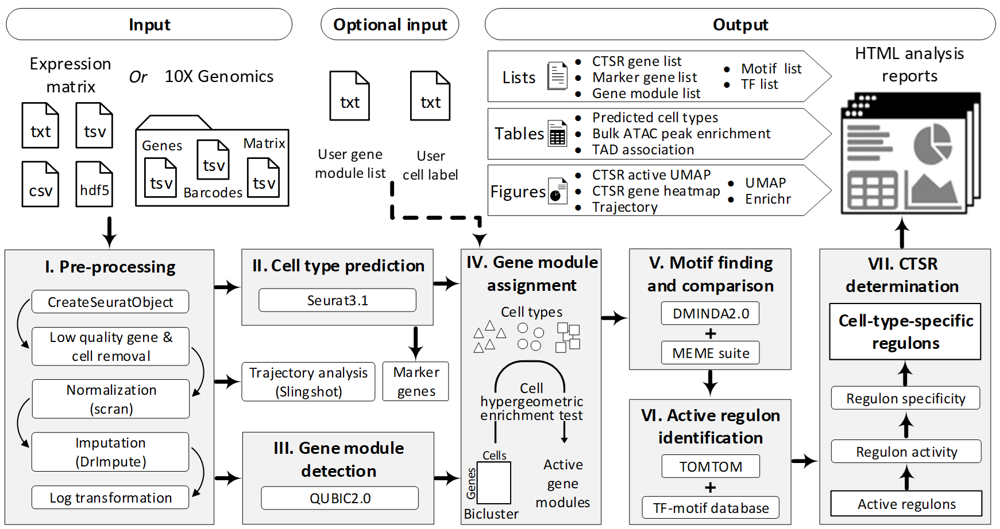

# IRIS3

The underlying regulatory mechanisms that induce the identity of cell types or physiological states are normally uncovered in the single-cell RNA-Sequencing (scRNA-Seq) analyses. A critical step in this process is to identify the cell-type-specific regulons (CTS-Rs), each of which is a group of genes co-regulated by the same transcription regulator in a specific cell type, in characterizing the transcriptomic heterogeneity of cell components in a tissue. Intuitively, these CTS-Rs can be computationally identified by integration of cell type prediction, gene module identification, and cis-regulatory motif analyses. 

Here we propose **IRIS3 (Integrated Cell-type-specific Regulon Inference Server from Single-cell RNA-Seq)** as the first-of-its-kind web server for CTS-R inference in human and mouse. Compared to other existing packages, IRIS3 predicts more accurate regulons from scRNA-Seq data, by a more efficient integrated pipeline. It is noteworthy that IRIS3 is an easy-to-use server and empowered by comprehensive interpretations and visualizations of the identified CTS-Rs. These CTS-Rs can substantially improve the elucidation of heterogeneous regulatory mechanisms among various cell types and allow reliable constructions of global transcriptional regulation networks encoded in a specific cell type.

IRIS3 is freely accessible from https://bmbl.bmi.osumc.edu/iris3/ with no login requirement. 

## Overview of IRIS3 pipeline

## How to submit job
https://bmbl.bmi.osumc.edu/iris3/tutorial.php#2submission 
## Example results illustration
https://bmbl.bmi.osumc.edu/iris3/tutorial.php#3example
## FAQ
https://bmbl.bmi.osumc.edu/iris3/more.php#4FAQ 
